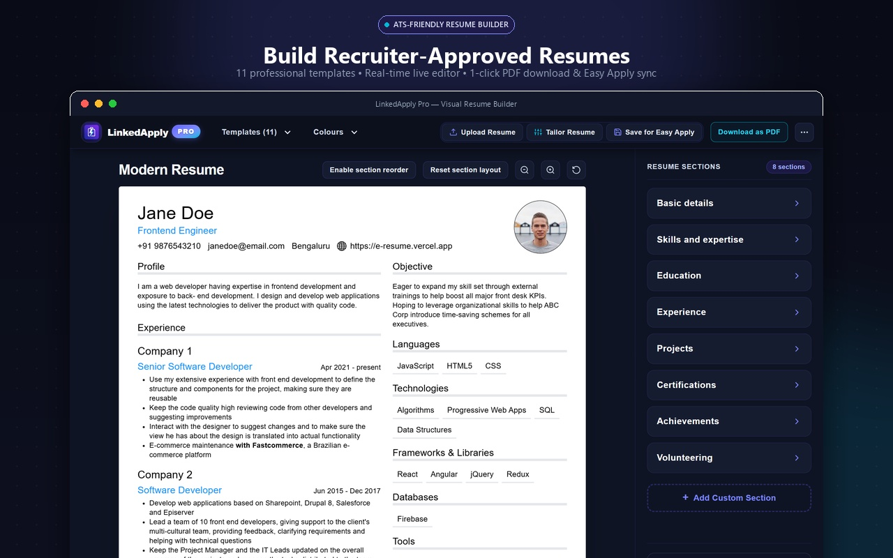
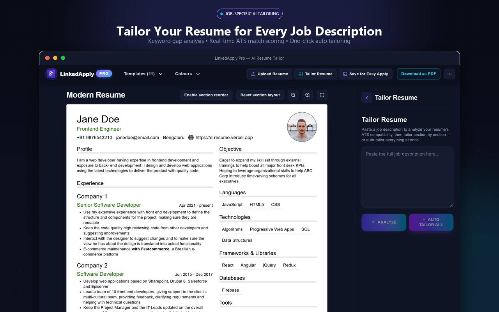
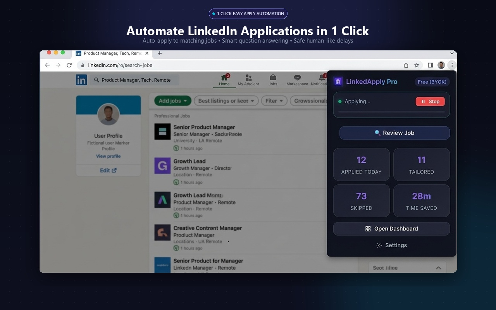
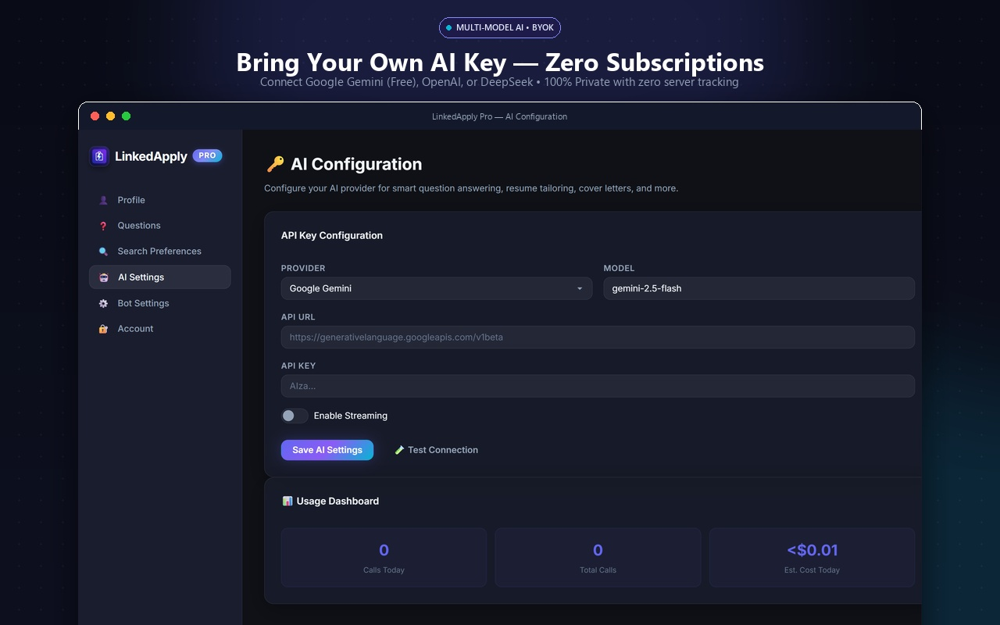
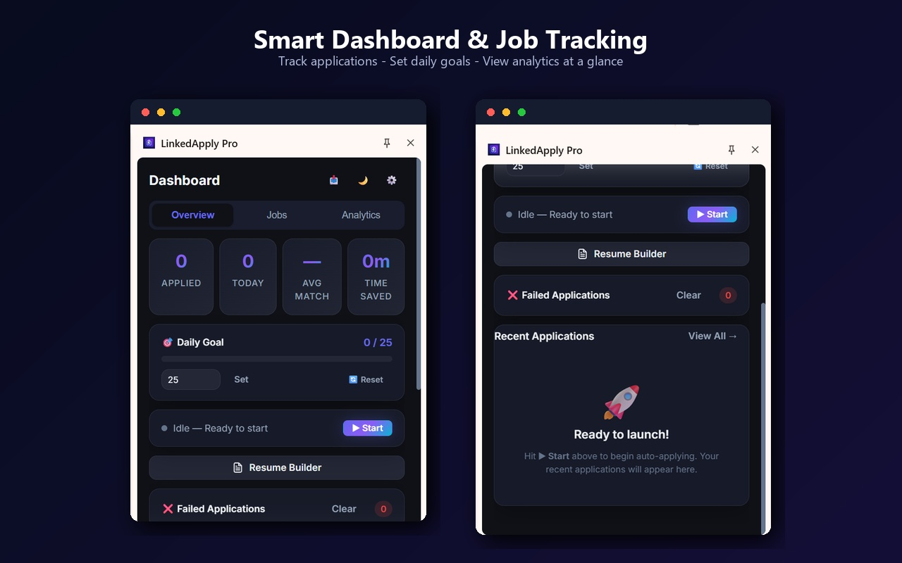

# LinkedApply Pro — Official Website, Docs & User Guide

Official public website, interactive user guide manual, Privacy Policy, and Terms of Service for **LinkedApply Pro** — the privacy-first, zero-subscription, AI-powered LinkedIn job application assistant.

---

## 🔗 Quick Links

* 🌐 **Official Website**: [https://naamsanamone.github.io/linkedapply-site/](https://naamsanamone.github.io/linkedapply-site/)
* 📖 **Interactive User Guide**: [https://naamsanamone.github.io/linkedapply-site/guide.html](https://naamsanamone.github.io/linkedapply-site/guide.html)
* 🔒 **Privacy Policy**: [https://naamsanamone.github.io/linkedapply-site/privacy.html](https://naamsanamone.github.io/linkedapply-site/privacy.html)
* 📄 **Terms of Service**: [https://naamsanamone.github.io/linkedapply-site/terms.html](https://naamsanamone.github.io/linkedapply-site/terms.html)
* ⚡ **Install on Chrome**: [Chrome Web Store Listing](https://chromewebstore.google.com/detail/ajgnfmojakmcoicgnmnfefiliaeikmah?utm_source=item-share-cb)

---

## 🌟 Key Features

### 1. 🎨 Visual ATS Resume Builder
Build and customize professional, ATS-compliant resumes with 10 industry-standard templates (Classic, Modern, Creative, Minimalist, Technical, etc.). Customize accent colors, re-order sections dynamically, and export pixel-perfect PDFs or save directly for Easy Apply.

### 2. 🎯 Job-Specific AI Resume Tailoring
Paste target Job Descriptions to calculate dual-engine match scores (Keyword match %, Semantic embeddings, and Format/Completeness). Tailor summaries and bullet points automatically using the Google XYZ formula (*"Accomplished [X] as measured by [Y] by doing [Z]"*).

### 3. ⚡ 1-Click LinkedIn Easy Apply Automation
Intelligently completes multi-step LinkedIn Easy Apply forms, pre-fills answers from your configured profile bank, handles radio/dropdown questions, attaches your tailored resume, and advances forms seamlessly.

### 4. 🤖 Multi-Model Bring-Your-Own-Key (BYOK) AI
Use your own API keys with zero platform subscriptions. Works with free Google Gemini API keys, OpenAI (GPT-4o / GPT-4o-mini), DeepSeek, Anthropic Claude, and custom local or cloud OpenAI-compatible endpoints (Groq, Ollama).

### 5. 📊 Real-Time Automation Dashboard & Kanban Pipeline
Monitor daily submissions against safe recommended application limits (30–50 applications/day), review complete answer histories, and organize opportunities via an interactive Kanban board (Saved → Applied → Interviewing → Offered → Rejected).

---

## 🛡️ Privacy & Security First

LinkedApply Pro is built with a strictly client-side, local-first architecture:
1. **No External Database**: All profile information, questions, resumes, and application logs are saved locally in your browser via `chrome.storage.local`.
2. **Zero Telemetry**: No third-party analytics trackers, cookies, or remote surveillance.
3. **Direct AI Handshake**: Your device talks directly to the AI provider of your choice over HTTPS.
4. **No LinkedIn Credential Access**: The extension operates strictly within the active LinkedIn tab DOM and never touches passwords or auth tokens.

For complete details, please read our [Privacy Policy](https://naamsanamone.github.io/linkedapply-site/privacy.html).

---

## 📖 Complete Documentation

Explore the comprehensive [Interactive User Guide](https://naamsanamone.github.io/linkedapply-site/guide.html) covering:
- Installation & Chrome Developer Mode Setup
- AI Model Setup & API Key Generation
- Profile & Recruiter Question Bank Configuration
- Resume Builder & Live PDF Preview
- Job Description ATS Match Analysis & Bullet Tailoring
- Auto-Apply Safety Thresholds & Account Safeguards
- FAQ & Troubleshooting

---

## 📬 Support & Community

* **Report an Issue**: [Open a GitHub Issue](https://github.com/naamsanamone/linkedapply-site/issues)
* **Chrome Web Store Feedback**: [Leave a Review / Support Tab](https://chromewebstore.google.com/detail/ajgnfmojakmcoicgnmnfefiliaeikmah?utm_source=item-share-cb)
* **Author**: [@naamsanamone](https://github.com/naamsanamone)
